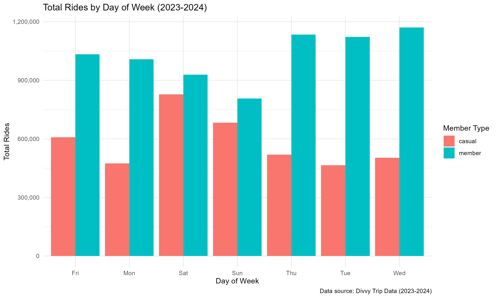
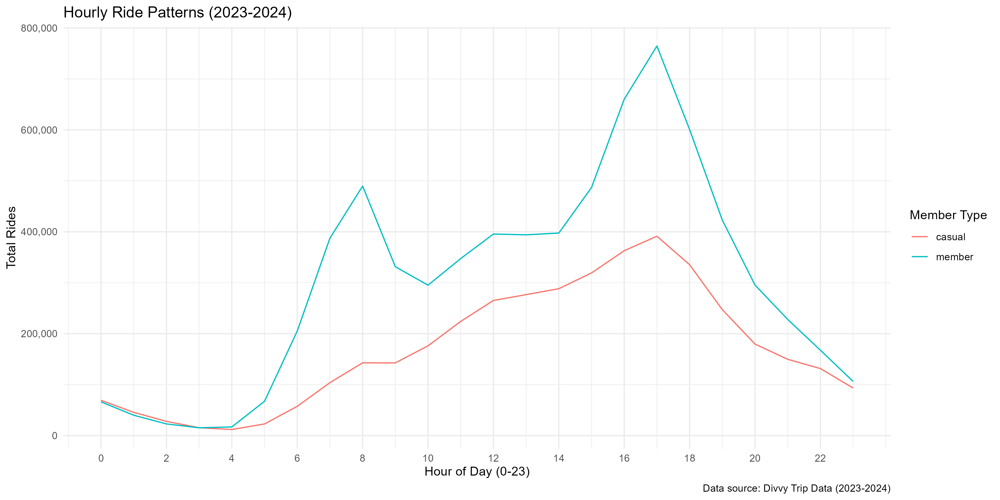
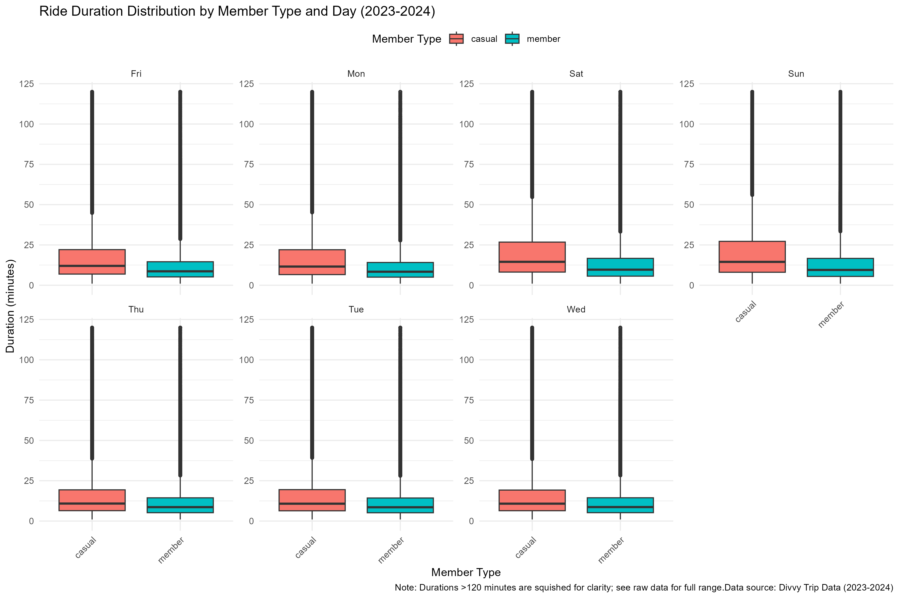
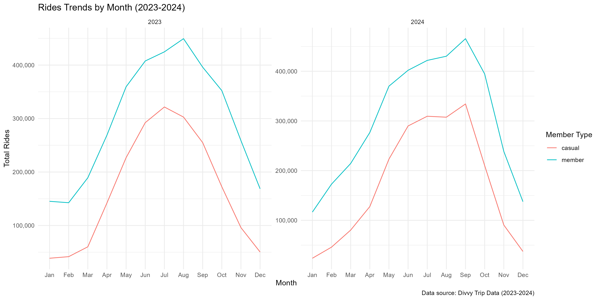
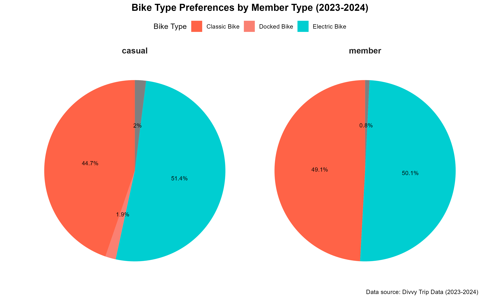

## Introduction
This portfolio presents my work on the Cyclistic bike-share case study, which is part of the Google Data Analytics Professional Certificate. Following the data analysis process—**Ask**, **Prepare**, **Process**, **Analyze**, **Share**, and **Act**—I examined trip data from 2023 to 2024. As a junior data analyst in the marketing analytics team, my focus was to identify key differences between annual members and casual riders, with the goal of supporting strategies to convert casual riders into long-term members.

- **Business Task**: Understand how casual riders and annual members use Cyclistic bikes differently to maximize annual memberships.
- **Data Sources**: Historical trip data from Divvy (2023-01 to 2024-12), licensed by Motivate International Inc.
- **Tools Used**: RStudio with packages like tidyverse, lubridate, and scales.
- **Code Repository**: [GitHub Link](https://github.com/yourusername/cyclistic-analysis) (see instructions below to set this up).
- **Key Deliverables**: Cleaned data, summary statistics, visualizations, and top recommendations.

## Data and Methodology

Analyze Cyclistic’s historical trip data to identify how usage patterns differ between casual riders and annual members, with the goal of providing insights that support marketing strategies to convert casual riders into members and maximize company growth. The analysis leveraged 24 monthly CSVs files from Divvy ( Jan 2023 - Dec 2024), totaling ~10-15M rows, containing ride details such as ride_id (unique ID), rideable_type (bike type), started_at/ended_at (timestamps), start_station_name/end_station_name (stations), and member_casual (to differentiate members vs. casual riders). The anonymized dataset, licensed by Motivate International Inc., was stored locally in RStudio for privacy and accessibility. The data is credible since it comes directly from Divvy operations, is complete for the period, and properly cited.

During the Process phase I Combined 24 CSVs, standardized data formats, converted timestamps to datetime objects, parsed dates (removing 29 invalid rows), calculated ride duration in min, filtered outliers (rides between 1-1440 minutes) and imputed NAs or missing values as "Unknown". Irrelevant columns were removed, and the cleaned dataset was exported as cleaned_divvy_data.csv.

## Key Findings

The analysis of Cyclistic’s 2023-2024 ride data reveals distinct usage patterns between annual members and casual riders: 

- Members show higher ride counts midweek (Tuesday-Thursday), indicating commuting habits, while casual riders peak on weekends (Saturday-Sunday), suggesting recreational use. This highlights distinct daily usage patterns critical for targeted marketing. Also, Members peak is during rush hours (7-9 AM, 17-19 PM), reinforcing commuting behavior, while casual riders peak is in the afternoon (13-16 PM), aligning with leisure activities. This supports tailored promotions by time of day.

Visualization 1: Total Rides by Day of Week 

Visualization 2: Hourly Ride Patterns 

- Casual riders exhibit longer median durations (>20 minutes) than members (10-15 minutes), especially on weekends, reflecting leisure-focused trips. This insight supports designing membership benefits for extended rides.

Visualization 3: Ride Duration Distribution by Member Type and Day 

- Both groups increase rides in summer (June-August) and decrease in winter (December-February), with casual riders showing greater seasonal variability. This trend informs the timing of seasonal campaigns to boost engagement.

Visualization 4: Rides Trends by Month 

- Casual riders slightly prefer electric bikes (51.4%) over classic bikes (44.7%) for recreational use, while members show a near-even split (50.1% electric, 49.1% classic) likely for commuting. Both groups rarely use docked bikes or scooters, with casual riders showing minimal adoption (1.9% docked, 2% scooters) versus members (0% docked, 0.8% scooters). This suggests targeted ebike promotions for casual riders and classic bike incentives for members could drive conversions.

Visualization 5: Bike Type Preferences by Member Type 

In conclusion, members exhibit a commuting-focused behavior, with higher ride counts midweek (Tuesday to Thursday) and during rush hours (7-9 AM, 17-19 PM), preferring electric bikes with shorter median durations (10-15 minutes). In contrast, casual riders show recreational usage, peaking on weekends (Saturday and Sunday) and afternoons (13-16 PM), favoring electric bikes with longer durations (often over 20 minutes), especially on weekends. Seasonally, both groups increase rides in summer (June-August) and decrease in winter (December-February), with casual riders showing greater variability.

These insights and the visualizations collectively reveal that members use Cyclistic bikes for commuting with consistent patterns, while casual riders engage recreationally with seasonal and weekend peaks. These findings address the business question of usage differences, enabling strategies to convert casual riders into members through commuter incentives, weekend packages, and seasonal offers.

## Recommendations

1. Launch a Weekend Electric Bike Promotion for Casual Riders

	- Casual riders prefer electric bikes and show peak usage on weekends, with longer durations indicating a leisure focus. Offering a discounted weekend package (e.g., 20% off electric bike rentals) could attract them to consider annual memberships.
			
	- Suggested Action: Pilot this promotion for 2 months, targeting weekend riders via in-app notifications, and track membership sign-ups.
2. Introduce a Commuter Incentive Program for Members 
	
	- Members’ consistent midweek and rush-hour rides (7-9 AM, 17-19 PM) suggest a commuting habit. Providing incentives like a free month after 20 weekday rides could enhance retention and encourage referrals.
			
	- Suggested Action: Roll out a points-based system, redeemable for ride credits, and evaluate participation after 3 months.
3. Implement Seasonal Marketing Campaigns 
	
	- Both groups increase rides in summer (June-August) and decrease in winter (December-February), with casual riders showing greater seasonality. Targeted campaigns (e.g., summer bike challenges, winter warm-up offers) can boost year-round engagement.
			
	- Suggested Action: Launch a summer contest with prizes for ride milestones and a winter discount code, assessing ride volume changes over 6 months.

## Appendix: Code and Visualizations

- **R Code**: Full script available on GitHub: [cyclistic_analysis.R](https://github.com/yourusername/cyclistic-analysis/blob/main/cyclistic_analysis.R).
- **Visualizations**:
  - Rides by Day: 
  - Duration Boxplot: 
  - Rides by Month: 
  - Rides by Hour: 
  - Bike Type Preference: 